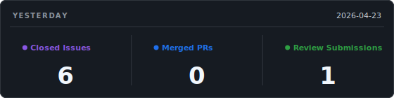
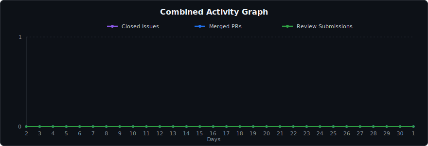

<!-- stats-autogen -->
# Hi, I'm m-itoi 👋

## Yesterday

  

## Activity Stats

  

📈 **[Interactive chart (zoom · pan · range filter)](https://m-itoi.github.io/m-itoi/)**

Stats are regenerated daily (JST-based). Numbers reflect one work organization.
